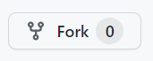

# PRG-web

This repository is the webpage of the Polyteknisk Radiogruppe part of Technical University of Denmark placed in Copenhagen. This webpage is created with [gohugo](https://gohugo.io/), [Markdown](http://es.wikipedia.org/wiki/Markdown) and `HTML/CSS`.

[Gohugo](https://gohugo.io/), or Hugo, is a framework for building static websites. It makes easy to add new content to a new webpage. Basically the posts are written in [Markdown](http://es.wikipedia.org/wiki/Markdown), and there is a layout that builds the hole site. In order to add new content you will need to add a new text file in markdown.

## How is it developed?

This web is based on a theme called whiteclub, that you can dowload [here](https://github.com/acien101/WhiteClub-Hugo-Theme), and it is created with `HTML/CSS/BOOTSTRAP`. Although the posts are written with markdown, the layout simplify the creation of new posts witn a uniform style.

## How to install Hugo?

It is easy to install hugo in a Linux machine using `snap install hugo`.

There is more information of how to install hugo: [Install Hugo](https://gohugo.io/getting-started/installing/)

## How to use Hugo?

Hugo is a really easy to use software. To render a web in your machine you need to execute:
```
$ hugo server
```

## ¿How to add new content to this repository?

In order to send your work to this blog you need to copy the global repository in a personal repository (fork), make your changes, send this changes to the global repository for review by an administrator, and when is approved it is added to the web page.

To do this you have to follow the next steps:
1. Create a copy of the original repository (`Polyteknisk-Radiogruppe/Polyteknisk-Radiogruppe.github.io`) in your github user account, this is called **fork**. To do this go to the button called **Fork**:



2. In your Github user account will have created a repository with the hugo webpage. Clone this repository **recursively** in your local machine. Open your terminal and execute the following command, changing `URL_REPO_FORK` with the URL of your forked repository.

```
$ git clone --recursive URL_REPO_FORK
```

3. Make your changes in the webpage. In the next section it is explained how to add new content.
4. When your changes are done, review that everything is working how you want to:

```
$ cd Polyteknisk-Radiogruppe.github.io
$ hugo server
```

The command output tells you that the web is rendered in *localhost*. Open this link and review your work.

5. When everything is done, upload your changes to your repository:
```
$ git add .
$ git commit -m "COMMENT EXPLAINING WHAT YOU HAVE DONE"
$ git push
```

6. To send your changes to the *global* repository you have to create a **Pull Request**, this is sending a request for your changes to be added to the server, with the approval of an administrator. Go to your repository and go to Pull Request:


## How to add a new activity?

To add a new activity to the web page, copy the file `examples\2018-12-02-Example-activity.md` in the folder `content\activities` and rename it with the name of the activity. The name of the file should be `YYYY-MM-DD-Name-of-the-activity.md`. For example:

```
2021-12-15-Working-with-SDR.md
```

And the folders will have the next structure:

```
├── content
│   ├── activities
│   │   ├── 2021-12-15-Working-with-SDR.md
```

Update the file with the information of the activity.

To watch the page execute the command `hugo server` and go to the url that is in the output of the command.

## How to add a new post in the blog?

To add a new post in the blog, copy the file `examples\2019-01-28-blog-post-example.md` in the folder `content\blog` and rename it with the title of the post. The name of the file should be `YYYY-MM-DD-Name-of-the-post.md`. For example:

```
2021-12-15-How-to-use-FT8.md
```

And the folders will have the next structure:

```
├── content
│   ├── blog
│   │   ├── 2021-12-15-How-to-use-FT8.md
```

Update the file with the information of the activity.

To watch the page execute the command `hugo server` and go to the url that is in the output of the command.

## How to add images?

If you want to add new pictures in your posts, put then in `static/blog/DATE` if it is a post in the blog, and `static/activities/DATE` if it is a activity. You can reference the image in your post like this:

```

```
